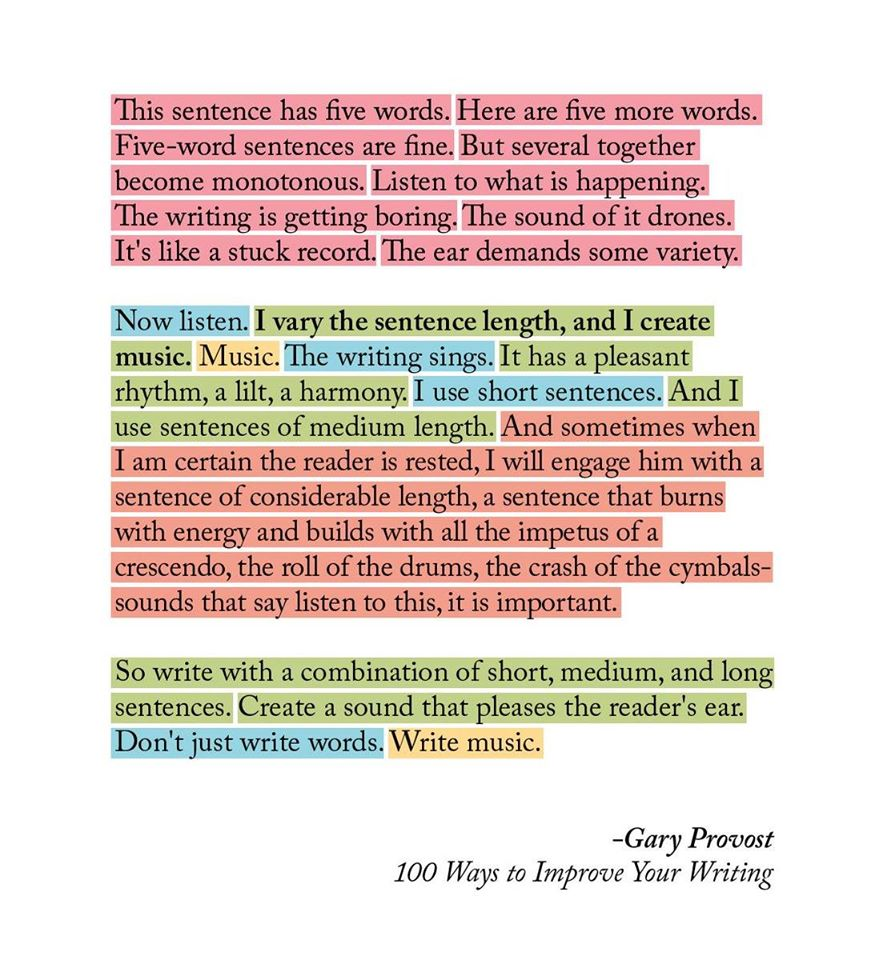

[Leave a Comment](https://tinkerdrop.com/blog/i-write-to-sing-out-what-i-think#respond) / [Học](https://tinkerdrop.com/learn), [Học kể truyện](https://tinkerdrop.com/learn/hoc-ke-truyen), [Path to Mastery](https://tinkerdrop.com/mastery), [Refine the Craft](https://tinkerdrop.com/mastery/refine-craft) / By [vantt](https://tinkerdrop.com/author/vantt "View all posts by vantt")

> I write to SING out what I think.
>
> Don’t just write words, write music.
>
> The sapiens vibrate with rhythm.

