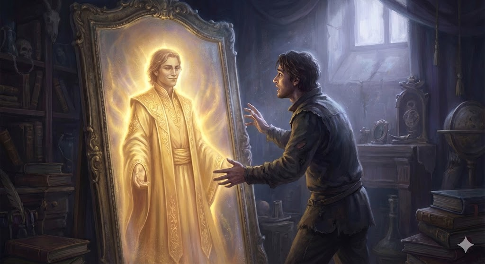

## **Kiến Thủ là gì ?**

> Là sự chấp chặt vào quan điểm nhận thức, tin vào điều mình chưa thấy rõ và bác bỏ điều mình chưa thông.

—

Bắt đầu đi sâu tìm hiểu về đạo lý, tiếp xúc thêm các trường phái tâm linh ngoài Phật pháp, được tiếp cận nhiều triết lý hay, mang tính bước ngoặt, nhưng trong sâu thẩm, bắt đầu phát sinh nhiều sự hoài nghi khó giải thích.

Nhận thấy đã có nhiều sự so sánh, suy xét giữa các trường phái tâm linh,  đan xen ít nỗi sợ và hoang mang. Sợ vì sẽ vội vã tin vào những điều siêu hình đầy cuốn hút. Sợ vì mình sẽ đánh giá, đưa ra những phê phán về điều _chưa thực chứng_ gây nên tà kiến. Sợ vì sự đóng chặt vội vã khiến không thể mở lòng tiếp bước trên con đường khai sáng.

Tất cả các con đường tâm linh đều muốn đem lại điều tốt đẹp. _“Từ bi là tình thương vô hạn”_, _“nhập định là an lạc vô biên”_, hay thực tế hơn _“phước đức là nền tảng kiến tạo đời sống sung túc dài lâu”_. Tất cả những khái niệm đó đều tốt đẹp, đều thúc đẩy con người “_hành động ráo riết_“. Mạc pháp rồi, phải hành động, phải ráo riết, không thì không kịp. Từ Minh giáo cho đến Nhật Nguyệt thần giáo đều phát biểu như vậy.

Tôi có nổi sợ trước những ám thị mang tính vô hình như vậy. Tôi không nhìn ra người ta có lợi ích gì từ những ám thị này. Nhưng chính chúng ta, những con người thực hành theo các con đường tâm linh đang nuôi dưỡng một lòng tham vi tế hơn, đang mong muốn và nuôi dưỡng một tự ngã trở nên siêu việt hơn.

Mình có niềm tin chắc chắn Tâm là chủ thể chính đưa ta vững bước trên con đường tâm linh. Phải luôn tâm niệm bảo vệ sự thuần khiết của Tâm, nó chính là Huệ Mạng của người hành giả. Phải luôn giữ Tâm trên con đường Chánh Kiến và đặc biệt không được đóng nó lại.

Dưới Đây là điều nhắc nhở dành cho Tâm mỗi khi mình bắt đầu tiếp cận và học tập điều gì đó mới.

—

> Mục tiêu của thực hành tâm linh là làm trong sạch Tâm, nhóm lên ngọn lửa trí tuệ.
>
> Tâm con người về cơ bản là rất tốt, rộng lượng và từ mẫn. Nhưng có thể nó đã không thường làm việc cùng với trí tuệ.

Vì có lòng từ bi nên bạn đến làm việc tại một bệnh viện hay trại tế bần. Nhưng bạn thấy rằng có nhiều quan liêu ở đó và bạn không thể làm những điều mà mình muốn. Bạn thấy mình cần đấu tranh chống lại hệ thống làm việc ở đó, và rồi bạn kiệt sức bởi sự cố gắng của mình. Bạn kết luận rằng lòng từ bi của mình không được sử dụng theo một phương cách tốt nhất. Rồi bạn bỏ cuộc.

Bởi vì chúng ta suy nghĩ các thứ phải nên như thế này hay như thế kia, rồi khi nó không giống như vậy thì chúng ta thất vọng; và tâm trạng thất vọng đã che mờ sự sáng suốt mà chúng ta cần có cho tình huống. Không có trí tuệ, khiến ta bám chặt vào từ ngữ, định kiến của riêng mình hoặc chấp chặt vào một vấn đề nào đó mà chúng ta nghĩ là quan trọng.

Khi chúng ta muốn phát khởi lòng từ bi, căn bản chúng ta phải chấm dứt kiểu làm việc bằng cảm tính. Do đó nếu không có trí tuệ, lòng từ bi sẽ không làm việc hiệu quả. Trí tuệ giúp chúng ta không đặt điều kiện và không thiên vị trong những việc làm của mình.

Với trí tuệ, chúng ta không bị giới hạn nơi một nguyên nhân hay mục đích duy nhất; chúng ta nỗ lực hết mình trong mỗi tình huống được đưa ra, và rồi chúng ta tiến lên.

> _Trí tuệ là sự cởi mở giúp chúng ta thấy được những gì là cốt tủy và hữu hiệu nhất._

Trí tuệ là những nhu cầu thật sự cần được chứng nghiệm thông qua thực hành. Trí tuệ giúp chúng ta tự chiêm nghiệm, tự loại bỏ những điều không phù hợp, và dạy chúng ta rằng những khác biệt này không khiến chúng ta rút lui. Chúng không ngăn chặn chúng ta vận dụng lòng từ bi bằng sức mạnh và ý chí lớn hơn.

> _Không phải là trí tuệ nếu chúng ta đơn giản tin tưởng vào những gì người khác nói lại._

_Trí tuệ thực sự là nhìn thấy trực tiếp và tự mình hiểu_. Ở mức độ này, trí tuệ _**làm cho tâm cởi mở hơn**_.

- Lắng nghe những quan điểm của người khác hơn là tin mù quáng
- Cẩn thận xem xét những sự kiện ngược lại hơn là vùi đầu trong mê lộ
- Phải khách quan hơn là thành kiến hay phe phái
- Dành thời gian để hình thành ý kiến và niềm tin, hơn là chỉ chấp nhận điều đầu tiên ta nghe thấy hay điều dễ cảm xúc nhất đưa đến cho ta
- Luôn sẵn sàng thay đổi niềm tin một khi sự thật tương phản lại ta.

Người làm được điều này chắc chắn là khôn ngoan và cuối cùng đến gần với hiểu biết chân chính.

