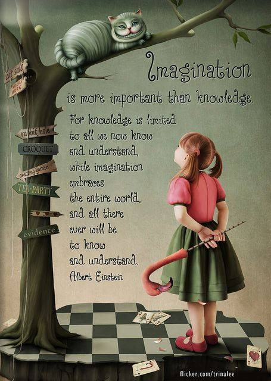

[Leave a Comment](https://tinkerdrop.com/blog/ngoi-truong-nao-cho-con#respond) / [Học](https://tinkerdrop.com/learn), [Học chơi với con](https://tinkerdrop.com/learn/hoc-choi-voi-con) / By [vantt](https://tinkerdrop.com/author/vantt "View all posts by vantt")

Đây là bài copy lại trên Facebook tôi đã đăng vào ngày [21/7/2017](https://www.facebook.com/photo.php?fbid=10154581783061246&set=a.10150500177321246&type=3&theater).

Năm nay con gái vào lớp 1, hai vợ chồng lo chạy trường, lo tìm hiểu các phương pháp giáo dục cho con mới chợt nhìn lại anh lớn năm nay đã vô lớp 5.

Bạn biết đủ thứ, cái gì cũng bắt chước được, tuy nhiên bắt đầu có những biểu hiện bớt tò mò, bớt quan tâm tới thế giới xung quanh, bớt đặt câu hỏi và đặc biệt là không biết mình phải làm cái gì bây giờ. Nếu tắt internet hoặc tivi bạn sẽ trở nên stuck và thụ động. Đến một nơi lạ là sẽ hỏi giờ mình làm cái gì bây giờ đây ba?

Ngẫm lại bản thân, ở tuổi U40 mình cũng không biết phải làm cái gì tiếp theo bây giờ. Có nhiều câu hỏi tự đặt ra cho bản thân cũng không biết phải trả lời làm sao?

- Tôi là ai?
- Tôi đang làm gì đây?
- Tôi phải làm gì để thích ứng với thế giới đang đổi thay chóng mặt thế này?
- Tôi nên làm cái gì với những thứ tôi đang có trong tay?

Ngày nay chúng ta sống trong thế giới mà mình không biết nó sẽ thay đổi như thế nào trong 10 năm tới,  vì vậy trẻ em phải được đào tạo để có năng lực đối mặt với sự thay đổi một cách tự tin và quyết đoán. Ở cái tương lai mà robot có thể làm thay con người thì kỹ năng có vẻ như không còn quan trọng nữa. Ở cái tương lai mà bất kỳ kiến thức nào trẻ con đều có thể kiếm được sau vài phút thì việc đến trường để tiếp thu cái kiến thức nó không còn quan trọng nữa.

### Vậy con người tương lai cần gì?

> Có vẻ như năng lực (capacity) lại trở nên quan trọng hơn kỹ năng (skill).

Chúng phải có khả năng linh hoạt, chúng phải có khả năng thích ứng, chúng sẽ phải biết gắn kết, chúng sẽ phải sáng tạo và phải có khả năng tưởng tượng ra một thế giới mà chúng muốn thay đổi.

Với trí tưởng tượng chúng có thể tự thiết kế nên thế giới của chính mình và khi đó máy móc sẽ làm phần lớn công việc còn lại.

### Vậy ngôi trường nào cho con?

Thật là khó quyết định khi cái hệ thống giáo dục cũ vẫn ám ảnh quá lớn đến suy nghĩ và hành xử của thế hệ chúng ta, trong khi làn gió giáo dục mới vẫn chưa đủ vững vàng để có thể khẳng định rằng sẽ thổi một luồng sinh khí mới cho thế hệ tiếp theo.  Đưa con vào một hệ thống nào cũng đều là sự đánh đổi mang nhiều rủi ro của ba mẹ. Cuộc đời của một đứa trẻ lại là cuộc chơi mang nhiều tính may rủi của người lớn. Nhưng ở cái tuổi này mình tin rằng sức mạnh của kiến thức cũng chỉ bó hẹp phần nào trong giới hạn hiểu biết của chính nó, trí tưởng tượng mới mang lại không gian không giới hạn cho tương lai của một đứa trẻ.

> KNOWLEDGE ISN’T POWER
>
> IMAGINATION IS
