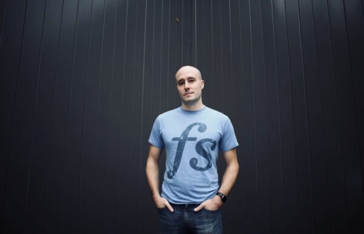

[Leave a Comment](https://tinkerdrop.com/blog/nhung-nguoi-thay-cua-toi#respond) / [Học](https://tinkerdrop.com/learn), [Học yêu bản thân](https://tinkerdrop.com/learn/hoc-yeu-ban-than) / By [vantt](https://tinkerdrop.com/author/vantt "View all posts by vantt")

Trong dân gian có từ Đạo Sư.

Trước đây nghĩ rằng Đạo Sư là người chỉ ta đường đi lối về, là người chỉ ra thành công và tương lai sáng lạng cho mình. Mãi về sau mới hiểu rằng không người thầy nào có thể mang lại lời hứa cũng như đảm bảo thành công cho học trò của mình.

Thành công của mỗi người hay con đường của mình cũng chỉ do mình lựa chọn bước đi mà thôi. Không ai có thể dọn sẵn cho mình.

Vậy Đạo Sự dạy ta điều gì?

> Ta nói con nghe, ta mất 30 năm cuộc đời để rồi cuối cùng nhận ra không nên đi con đường đó.

Đạo Sư đơn giản là người truyền cho ta kinh nghiệm để đừng lầm đường lạc bước, kinh nghiệm đã được trả giá bằng chính cuộc đời họ.

Dưới đây là vài trong số những Đạo Sư của tôi. Có nhiều người tôi không nhớ để liệt kê vô đây, nhưng trong danh sách này là những người thầy đã để lại cho tôi nhiều bài học sâu sắc nhất.

### Đức Phật

Tôi không là Phật tử, cũng chưa có ý định quy y. Tôi cũng chỉ hữu duyên được chạm đến những lời dạy của ngài. Đức Phật là một người thầy của nhân loại, là người đã để lại cho chúng ta nhiều sự thật, nhiều phương pháp tu chỉnh thân tâm mà tôi luôn coi là kim chỉ Nam của mình:

- Quy luật Nhân quả
- Giới – Định – Tuệ,  ba giá trị cốt lõi của đời người
- Phật – Pháp – Tăng, ba báo vật lớn nhất của đời người (thầy giỏi, bạn tốt và sách hay)
- Văn – Tư – Tu, phương pháp học hữu hiệu nhất.

### Hòa thượng Tịnh Không

Tôi có duyên được nghe nhiều bài pháp của ngài. Nhưng tôi nghĩ người tác duyên lớn nhất giúp tôi suốt những năm đó có thể nghe rất rất nhiều bài giảng của hòa thượng Tịnh Không chính là giọng người lồng tiếng đầy truyền cảm của cô.

Nghe hòa thượng thuyết giảng, tôi được biết khá nhiều đến lời dạy của Phật mà sau này trở thành nguyên tắc sống và là kim chỉ Nam cuộc đời tôi.

### Thầy Trần Việt Quân

Tôi hay gọi vui với bạn bè thầy là ông giáo làng. Một thầy giáo làng Việt Nam chính hiệu. Thầy là đồng sáng lập hệ thống trường Pathway Tuệ Đức. Thầy là người giúp tôi có cái nhìn hệ thống về những lời Phật Dạy. Thầy là người khai ngộ cho tôi hiểu thế nào là Tư Duy Theo Nhân Quả. Thầy là người dạy tôi có được bộ câu hỏi đơn giản và cao siêu nhất tôi từng dùng: **_Câu Hỏi Nhân Quả._**

Thầy luôn nhắn nhủ với mọi người:

- Nhân Quả là quy luật chi phối vũ trụ
- Không gì qua được cái Nhân là chính mình
- Giới Định Tuệ là năng lực lớn nhất đời người
- Phật Pháp Tăng là bảo vật quý nhất thế gian
- Văn-Tư-Tu là phương pháp học tuyệt vời nhất

### Cô Nguyễn Đoàn Kim Sơn

Cô Sơn là vợ thầy Quân. Sự dạy của cô cũng mang triết lý nhân quả sâu sắc như chồng mình.

Nếu như thầy Quân là người còn nhiều hoài bão và suy tư, cô lại là người nhẹ nhàng thanh thoát lạ kỳ. Lần đầu được nghe cô đọc diễn văn trên hội trường, tôi đã thầm muốn được học cô, để xem cách dạy của cô sẽ như thế nào. Tôi cảm thấy đâu đó một sự buông xã.

Hơn một năm sau tôi mới được học cô trọn một ngày, nhưng cô lại cho tôi cái nhìn rất sâu sắc về _**mục tiêu của việc đi học**_.

> Mục tiêu cao nhất của việc học là để hiểu được nhu cầu chính đáng của người khác.
>
> Chỉ khi nào đem được hạnh phúc chính đáng cho người khác, khi đó bản thân ta mới thật sự hạnh phúc.

### Shane Parrish – Farnamstreet

Tôi là người làm sản phẩm về Social Community, nhưng tôi chưa bao giờ hình dung ra một community tốt thật sự nó hoạt động như thế nào. Farnamstreet là một điển hình. Nó không phải là một linkedin, một quora hay stackoverflow, nó là một thứ hoàn toàn khác. Ở community của fs.blog, một thảo luận có thể kéo dài hàng tháng trời và để đọc hết và nghiễn ngẫm nó, bạn cần cả tuần.

Shane Parrish là người tạo ra Farnamstreet.

Tôi biết đến quy luật Nhân Quả theo cách tiếp cận của phương Tây khi được học về **_First Principle Thinking_** từ các bài viết của Shane. Nó là một dạng Tư Duy Theo Nhân Quả, là quy trình đi tìm nhân tố khởi đầu.

Ở Farnamstreet tôi bắt đầu sự nghiên cứu của mình cho các khái niệm về Mental Models. Mặc dù nó không phải là những bài viết xuất sắc nhất về mental models, nhưng nó là duyên khởi đầu cho con đường tìm hiểu về _**Multi-discipline Thinking**_ của tôi.

Và cuối cùng Farnamstreet giúp tôi hoàn tất một phát thảo đầu tiên về thế giới quan của chính mình.

### Kamal Ravikant

What is the truth in this situation

### Naval Ravikant

…

  
Alfred Adler (Life has no purpose)  
Seth Godin/Bernadette Jiwa (Marketing can make change)  
Garry Keller (The Focus Question)
