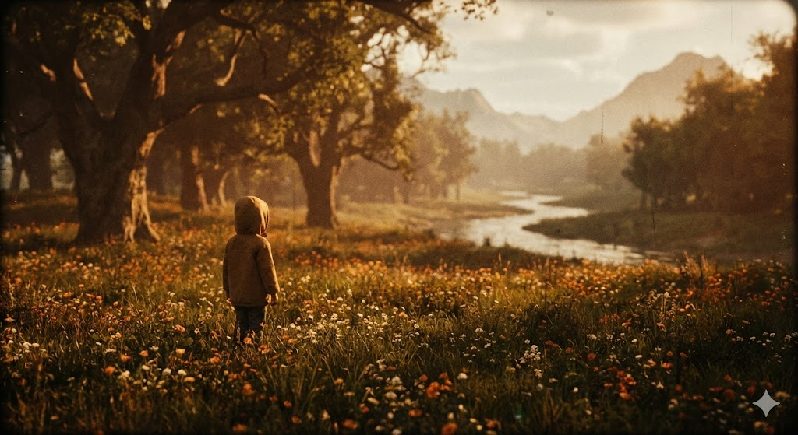

[Leave a Comment](https://tinkerdrop.com/blog/parents-do-not-raise-children-nature-does#respond) / [Conquer the Mind](https://tinkerdrop.com/mastery/conquer-mind), [Học](https://tinkerdrop.com/learn), [Học chơi với con](https://tinkerdrop.com/learn/hoc-choi-voi-con) / By [vantt](https://tinkerdrop.com/author/vantt "View all posts by vantt")

— on Reading **ATMAMUN, Kapil Gupta**

Parents do not raise children.  
_NATURE DOES_.

Nature does not make mistakes with children.  
_PARENT Do_.

Whatever a parent does in the name of his or her child, he is really doing for himself. Parents are enslaved by the need for their children to reflect well on the family name.

The greatest thing you can do for your child is to not interfere.

A child does not need a parent’s teaching.  
He needs a parent to create for him a certain environment. And this environment (with its wisdom) will do all of the necessary teaching.

If you create an environment of peace, the child will learn to be relaxed.

If you create an environment of understanding, the child will be open with his problems.

If you create an environment of silence, the child will become averse to the world’s noise.

If you create an environment of freedom, the child will have the courage to find his own way.

