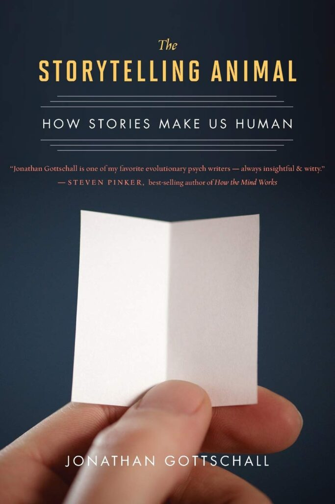

[Leave a Comment](https://tinkerdrop.com/blog/501#respond) / [Học kể truyện](https://tinkerdrop.com/learn/hoc-ke-truyen), [Refine the Craft](https://tinkerdrop.com/mastery/refine-craft), [Sách Hay](https://tinkerdrop.com/sach-hay) / By [vantt](https://tinkerdrop.com/author/vantt "View all posts by vantt")

Đọc Homo Sapiens chỉ có cảm nhận con người duy trì được quần thể đông hơn con thú ở chổ thích bà tám, thích kể chuyện phím.

Đến đọc cuốn này mới có cái nhìn sâu hơn việc con người bị kiểm soát bởi những câu truyện như thế nào.

Câu truyện như một sự diễn tập cho những điều chưa xảy ra, như một sự thoả mãn cho những mong muốn chưa đạt được. Khả năng dựng truyện đã len lỏi vào trong tâm trí, trong nổi sợ và trong khoa khát của mỗi con người. Thậm chí cả trong giấc mơ chúng ta cũng kể truyện cho chính mình.

*   Đọc để nhận ra biết kể truyện dễ thành công.
*   Đọc để nhận ra ta dễ bị lợi dụng bởi những câu truyện.
*   Đọc để cảnh giác với những câu truyện của chính mình. Vì tâm trí của ta cả ngày cũng chỉ biết kế truyện mà thôi.

Đọc để nhận thấy không đọc truyện cho con là một thiệt thòi lớn nhất.

