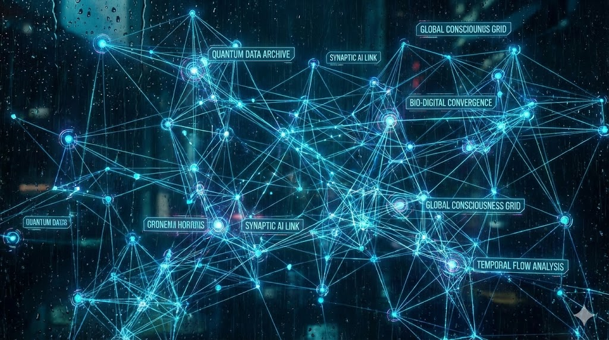

## Tagging, sự tự hào

Tôi là Knowledge Worker. Có chút thành tựu là nhờ vào kho lưu trữ kiến thức của mình (PKM – Knowledge Management System). Hơn chục năm toàn dùng Tag để phân loại, sắp xếp thông tin. Tôi hãnh diện về điều đó. Hãnh diện công sức đã bỏ ra để tổ chức. Nó là kho báo thật sự.

Tôi hãnh diện về độ chi tiết mà mình đã dày công mô tả cho rất nhiều thông tin được lưu trữ. Tôi cảm thấy khó hiểu và hơi tự cao đối với những người vẫn dùng phương pháp lưu trữ tuyền thống theo kiểu thư mục.

Cho tới ngày tham gia khóa học [Build a Second Brain](https://www.buildingasecondbrain.com/), tôi nhận ra:

> Dùng Tag để mô tả , sắp xếp thông tin là không hợp lý. Sắp xếp thông tin kiểu thư mục truyền thống lại vượt trội hơn.

Tôi đã hoang mang.

Mà điều đó đúng. Ngẫm lại thấy hệ thống quản lý file của các hệ điều hành không có tag. Google Docs cũng không tag. Các xếp của tôi không dùng tag, các thầy cô của tôi cũng vậy. Họ vẫn dùng kiểu thư mục truyền thống. Đặc biệt họ đều là những người thành công và làm việc hiệu quả hơn tôi.

## Tagging, một tham vọng

Khi nói về kỹ năng làm việc hiệu quả, chúng ta luôn tin rằng cách tổ chức theo kiểu đánh Tag có ưu thế hơn cách tổ chức theo kiểu folder truyền thống. Tag đem đến nhiều tiện nghi không thể chối cải:

- tag cho phép một chủ đề được xếp ở nhiều nơi
- gắn một tag nhanh hơn xếp vào một folder
- tag cho phép một cơ chế tìm kiếm kết hợp ngẫu nhiên, độc nhất và nhanh nhất

Chúng ta đánh tag với hi vọng ngày nào đó chúng sẽ được xài vào việc gì đó (chưa xác định).

Tagging cho ta niềm tin có thể tạo ra một hệ thống phân loại hoàn chỉnh và phổ quát cho mọi loại thông tin (Universal Taxonomy).  Ta tin rằng sẽ thiết lập được mọi quan hệ giữa mọi loại chủ đề, mọi ý tưởng mà ta có. Khi cần, chỉ dùng một từ khóa tìm kiếm hoặc kết hợp nhiều từ khóa tìm kiếm thì thông tin đó và mọi khái niệm liên quan đều sẵn trên đầu ngón tay, một cách hoàn chỉnh.

Đó chỉ là tham vọng.

Hy vọng vào tagging sẽ đem đến một sự quản lý và tổ chức hoàn chỉnh là chưa hiểu rõ hạn chế cũng như điểm mạnh trong cách thức hoạt động của chính não bộ chúng ta.

## Chúng ta rất lười

Tagging đòi hỏi phải đánh tag (mô tả) cho mọi thông tin khi nhập vào hệ thống. Ta còn phải tag tất cả sự phân loại và quan hệ của nó với tất cả những thông tin khác. Điều đó đòi hỏi một công sức rất lớn, mà ta thì rất lười. Về lâu dài ta ngán và không còn thói quen đánh tag cho thông tin khi đưa vào hệ thống.

## Trí nhớ của chúng ta rất tệ

Mindset của ta trong quá trình nhập liệu khác hoàn toàn so với quá trình tìm kiếm. Trong quá trình nhập liệu, ta không thể đoan chắc lúc tìm kiếm mình sẽ suy nghĩ và sử dụng tag gì. Tương tự lúc tìm kiếm, ta lại không thể nhớ nổi mình đã đánh những tag gì lúc nhập liệu.

Ví dụ trong một bài viết về đầu tư của Warrent Buffet, tôi đã đánh tag chữ Buffet nhưng khi tìm tôi lại dùng chữ Warrent.

## Thiếu tính định hướng (gợi ý)

Khoa học những năm gần đây có nhiều phát hiện quan trọng về nhận thức của con người. Tôi xin giới thiệu khái niệm Stigmergy Cognition. Tạm dịch là nhận thức có được thông qua tương tác gián tiếp với môi trường.

Chúng ta suy nghĩ không giống như máy tính. Máy tính lưu trữ hàng tỉ các khái niệm trừu tượng và từ đó tính ra kết luận. Chúng ta dùng chính cơ thể và các giác quan của mình tương tác với môi trường xung quanh mình và từ đó rút ra định hướng và hành động.

Nói đơn giản chúng ta nhờ môi trường xung quanh để lưu trữ và phân tích thông tin bởi vì não của chúng ta không giỏi làm điều đó.

Ví như khi đi rừng, chúng ta không thể nhớ hết tất cả lộ trình mình đã đi qua có những đặc điểm gì, có bao nhiêu ngã rẻ… Nhưng chỉ cần chúng ta đi theo từng chặng, ở mỗi chặn, cứ nhìn vào cảnh vật xung quanh, chúng ta lại nhận ra là mình nên đi theo hướng nào để đến chặn tiếp theo.

Đây là cách mà não của chúng ta đã được rèn luyện từ bao đời, từ thời còn chưa có đường xá thuận lợi dễ dàng, từ thời còn là những động vật nguyên sơ phải di chuyển trong rừng rậm. Bằng cách hạn chế thông tin chỉ được kích hoạt ở một môi trường cụ thể nào đó, ta đã khắc phục được hạn chế về trí nhớ của mình.

Như vậy tổ chức theo kiểu thư mục truyền thống là một hình thức tận dụng stigmergy. Hẳn những người đang dùng phương pháp tổ chức này vẫn chưa tìm hiểu về Stigmergy, nhưng họ lại cảm thấy hoàn toàn chủ động và thoải mái vì họ đang sử dụng đúng năng lực của mình.

Ngược lại như tôi, tận dụng tagging quá mức đã chuyển mình qua chế độ làm việc abstract, đã gần như từ bỏ đi năng lực vốn có của loài người.

## Sự hổ trợ sai lầm của các công cụ đánh tag

Các ứng dụng quản lý tài liệu hiện nay hổ trợ việc đánh tag một cách quá mức dễ dàng. Người dùng chỉ cần đánh bất kỳ tag nào, mọi việc coi như xong, kết quả đúng sai công cụ tự xử lý.

Điều này dẫn tới số lượng tag phát sinh quá mức. Các tag trùng hoặc tag không hoàn chỉnh cũng được tạo ra một cách tùy tiện.

## Vậy chúng ta nên làm gì?

PKM không phải là một nấm mồ của kiến thức. PKM phải là công cụ của hành động. Nó phải hỗ trợ suy nghĩ, hỗ trợ sáng tạo. Đó là điều tâm đắc nhất tôi được học.

Quan trọng không phải bao nhiêu thông tin được nhập vào hệ thống. Quan trọng là bạn xài được bao nhiêu trong lúc cần nhất.

Ý nghĩa của một hệ thống sắp xếp không chỉ để phân loại, mô tả ngữ nghĩa trừu tượng của thông tin. Nó phải là công cụ thúc đẩy hành động. Nó phải giúp thông tin mang tính hành động hơn.

Hãy đánh tag tài liệu của mình để định hướng khi nào chúng sẽ được xài, cho cái gì và bằng cách nào.

Tôi sẽ có bài viết khác mô tả chi tiết hơn hệ thống đánh tag của tôi đã thay đổi như thế nào.
